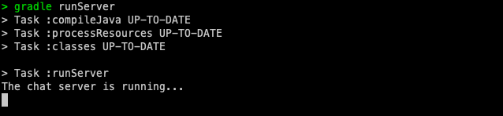
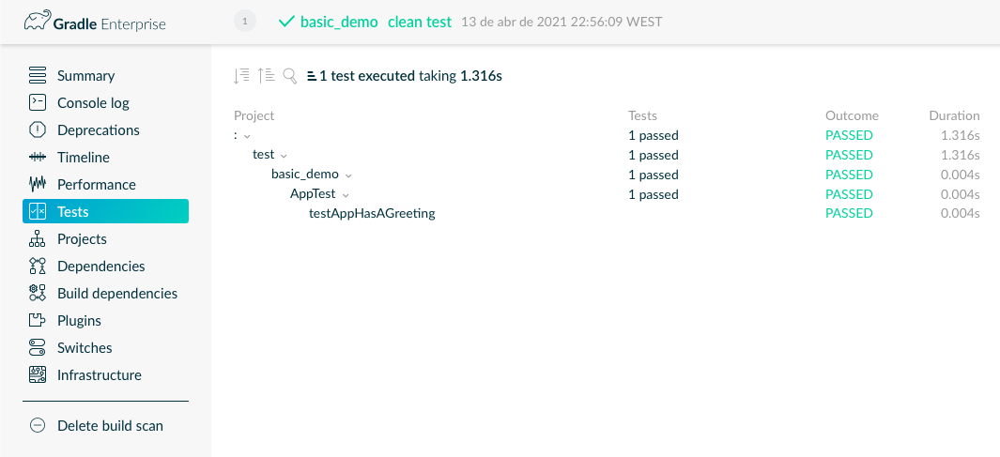

# Ca2 - Part 1 -Demo Gradle

## 1. Downloading example

First, it is necessary to download the sample project.

You can download the Git repository, to a folder of your choice, through:

```
$ git clone https://bitbucket.org/luisnogueira/gradle_basic_demo.git
```

For the purpose of this course, the files were copied to the folder for this tutorial, not copying the .git folder.

## 2. Experiment the Application

All commands must be used via the terminal from the project root directory.

### 2.1. Build

To try the application, we have to build a .jar file. If we have a gradle installation on the machine, we can use the following command:

```
$ gradle build
```

If we haven't installed the gradle and don't want to install it, we can use the executable ./gradlew, which is present in the project:

```
$ ./gradlew <command>
```

### 2.2. Run Server

To run the server, use the following command:

```
$ java -cp build/libs/basic_demo-0.1.0.jar basic_demo.ChatServerApp <server port>
```
Where the server port must be a valid number, for example 59001 (this port should be used if we don't want to make changes to the task of running a Client).

### 2.3. Run a Client

To run the client you must open a new terminal, the server is running through the process that is running in the previous terminal, and use the following command, which makes use of a gradle task already described in the build.gradle file:

```
$ gradle runClient
```

To use more clients, you must open new terminals and repeat the previous process.

## 3. Task to execute server

In order not to have to use the command used in point 2.2.,we can create a gradle task that runs the server.

We must then add the following task to the build.gradle file, present in the project's root:

```
task runServer(type: JavaExec, dependsOn: classes) {
    group = "DevOps"
    description = "Launches the server in localhost:59001 "

    classpath = sourceSets.main.runtimeClasspath

    main = 'basic_demo.ChatServerApp'

    args '59001'
}
```

We can then run the task and see if the server is running, using the command:

```
$ gradle runServer
```

Something similar to the following image should happen.



## 4. Add Unit Test

Now we are going to add a unit test.

### 4.1 Add test

The following test was taken from the support material:

```
public class AppTest {

    @Test public void testAppHasAGreeting() {
        App classUnderTest = new App();
        assertNotNull("app should have a greeting", classUnderTest.getGreeting());
    }
}
```

A test class was created in src/test/java/basic_demo directory with the name AppTest.

### 4.2 Changes in build.gradle

In build.gradle, sourceSets for classes and test classes were added:

```
sourceSets {
    main {
        java {
            srcDirs = ['src/main/java']
        }
    }

    test {
        java {
            srcDirs = ['src/test/java']
        }
    }
}
```

To run the tests and see a scan in website of gradle we can execute the following comand and access the link that is provided:

```
$ gradle clean test --scan
```

In the testing field we should see the following:



## 5. Task to Copy src folder

## 6. Task to Zip src folder