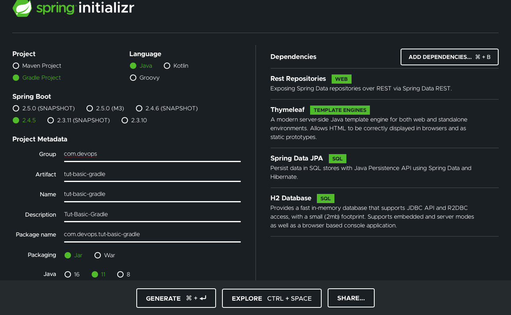
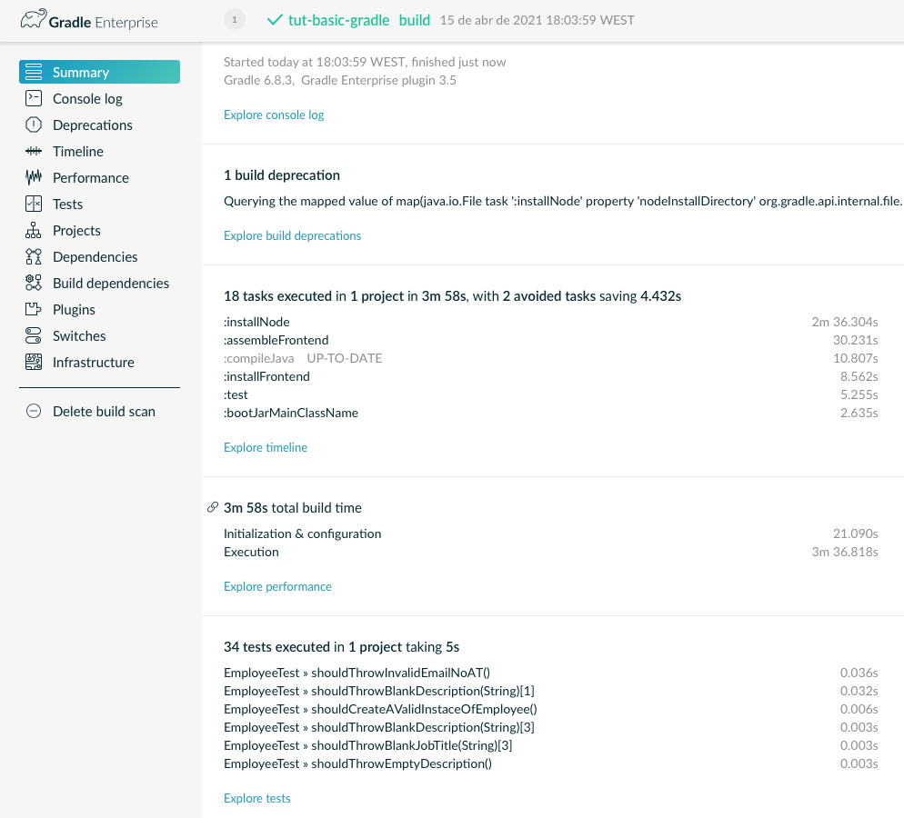

# Ca2 - Part 2 - Tut-Basic-Gradle

## 1. Set-Up

To start exploring Gradle we need to do some setup.

### 1.1. Start new Gradle spring project

First, we need to create a new Spring Boot project.

Go to https://start.spring.io and create the new gradle spring project with the following dependencies:
- Rest Repositories
- Thymeleaf;
- JPA;
- H2.

Like:



Click in generate and a zip file will be downloaded.

Unzip the file in the desired folder.

### 1.2. Changes in Src folder

Now we are going to replace the src folder of this new project with the tut-basic src folder made in Ca1. The webpack.config.js and package.json files must also be copied and copied at the root of the new project.

The folder src/main/resources/static/built/ must also be deleted, as it contains compiled files.

### 1.3. Add frontend plugin

If we now run the application, the web page in localhost: 8080 is empty, we have to install the plugin for the gradle to handle the frontend.

Command to run app, must be used in a terminal inside root of project:
```
$ ./gradlew bootRun
```

It is then necessary to add the plugin *org.siouan.frontend* to the build.gradle file.

```
plugins {
    id 'org.springframework.boot' version '2.4.4'
    id 'io.spring.dependency-management' version '1.0.11.RELEASE'
    id 'java'
    // Added to run fronted
    id "org.siouan.frontend" version "1.4.1"
}
```

It is also necessary to configure the plugin by placing the following code also in the *build.gradle* file:

```
frontend {
    nodeVersion = "12.13.1"
    assembleScript = "run webpack"
}
```

Last, but not least, we have to add the webpack to the scripts section of *package.json* to configure the webpack execution:

```
  "scripts": {
    "watch": "webpack --watch -d",
    // Add the next line
    "webpack": "webpack"
  },
```

### 1.4. Build

Now, let's build the project for the files related to the frontend to be compiled:

```
$ ./gradlew build
```

### 1.5. BootRun

To run the application we must use the following command:

```
$ ./gradlew bootRun
```

We must then also access the address *localhost:8080* from a browser to see what already appeared at the end of Ca1.

## 2. Add tasks

Tasks are added to the build.gradle file.

### 2.1. Add a task to copy the generated jar to a folder named "dist"

To create a task of type Copy, the type must be declared:

```
task <name_of_task> (type: Copy) {

}
```

So let's create a task that copies the jar file, created after build, to a "dist" folder, for that, within the task, the "from", "include" and the "into" must be declared:

```
task copyJar(type: Copy) {
    from 'build/libs'
    include '*.jar'
    into './dist/'
}
```


### 2.2. Add a task to delete all the files generated by webpack

To create a task of type Delete, the type must be declared:

```
task <name_of_task> (type: Delete) {

}
```

So let's create a task that deletes the files generated by webpack (path from root: src/main/resources/static/built/):

```
task deleteWebpackFiles(type: Delete) {
    delete './src/main/resources/static/built/'
}
```

This task should be run automatically by the gradle before running the **clean** task, so we must add the following to build.gradle:

```
clean {
    dependsOn deleteWebpackFiles
}
```

## 3. Experiment all the developed features

Let's explore the tasks previously added.

### 3.1. Execute task copyJar

To execute the copyJar task run the following command:

```
$ ./gradlew copyJar
```

After executing the command, a new directory called "dist" was created at the root of the project and inside it will be the .jar file.

### 3.2. Execute task deleteWebpackFiles

To execute the deleteWebpackFiles task run the following command:

```
$ ./gradlew deleteWebpackFiles
```

After executing the command, the /src/main/resources/static/built/ folder have been deleted.

### 3.3. Execute task clean

To check if the deleteWebpackFiles task is executed before the **clean** task, we have to create the files and directory again, running the build command again.

To execute the clean task run the following command:

```
$ ./gradlew clean
```

After executing the command, the /src/main/resources/static/built/ folder have been deleted.

### 3.4. Call tests when build

During the builds it was noticed that the existing tests in the project were not invoked, so the following sourceSet was added to the build.gradle file, for the tests to be executed during the build:

```
sourceSets {
    main {
        java {
            srcDirs = ['src/main/java']
        }
    }

    test {
        java {
            srcDirs = ['src/tests/main']
        }
    }
}
```

To check and see that the tests are run during the build we execute the following command:

```
$ ./gradlew build --scan
```

Following the link and the result must be:



## 4. Alternative

### 4.1. Analysis

### 4.2. Implementation

## 5. References

[Spring](https://spring.io)
[Gradle](https://gradle.com)
