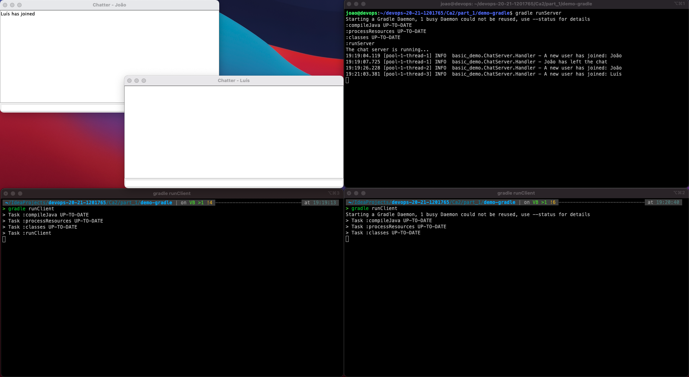
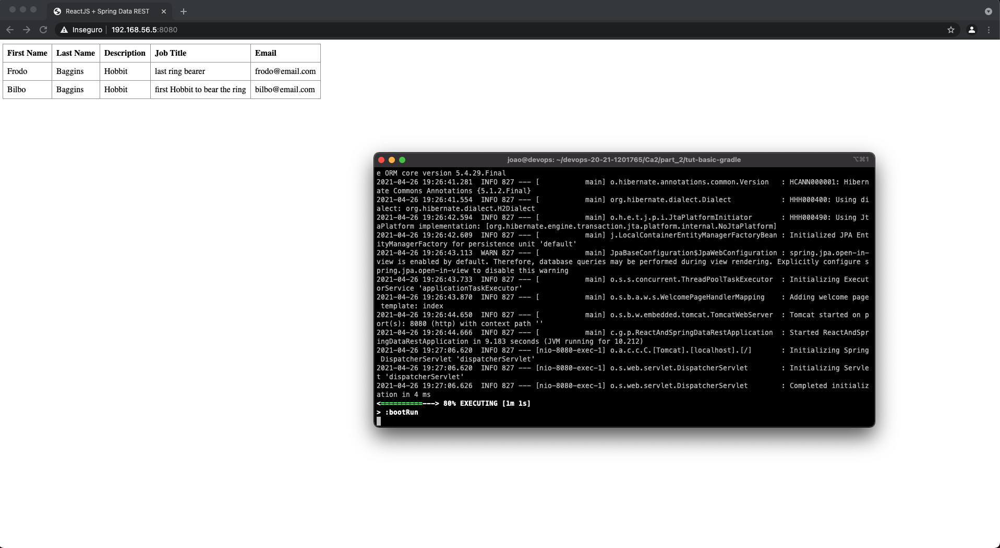

# Ca3 - Part1 - Virtualization

## 1. Set up the Virtual Machine 

The VM setup is described in the [support material](./assets/devops_ca3-part1.pdf) provided by the teacher.

Follow the suggestions for all the space allocated to the VM, I was spared and only gave 2GB of disk space,
and in the middle of the tutorial I had to make a new VM machine with more space (10GB).

## 2. Clone repository to VM

Through the host machine, we will ssh the VM through a terminal:

```
$ ssh <user>@<ip_address>
```

We must introduce the password setted in point 1..

Prior to the clone, we have to install git on the VM:

```
$ sudo apt install git
```

Now we must clone the remote repository:

```
$ git clone https://<bitbucket_credential>@bitbucket.org/Joao_Pinto_1201765/devops-20-21-1201765.git
```

## 3. Build

To build each project, we must be within the root of the project we intend to build. For example, for the demo-gradle:

```
$ cd devops-20-21-1201765/Ca2/part_1/demo-gradle
```

### 3.1. demo-gradle (chat application)

Inside the demo-gradle folder, try to build the project in gradle:

```
$ ./gradlew build
```

Oh No! Several problems can happen here!

#### 3.1.1. Different java versions

The version of java previously installed on the virtual machine is 1.8, and the one that was defined in the build.gradle 
was 11, so it has to be changed to 1.8.

#### 3.1.2. Incompatible Gradle version

If we use a gradle installation when trying to build on the VM, it must be compatible with the tasks and plugins
declared in build.gradle.

#### 3.1.3. Gradle wrapper not present

If we choose to use gradlew to build, gradle-wrapper.jar must be removed from .gitignore, otherwise it will be
impossible to use the wrapper.

### 3.2. tut-basic-gradle

Having resolved the problems above, inside the tut-basic-gradle folder to make the build, we execute the following command:

```
$ ./gradlew build
```

### 3.3 tut-basic-maven

In tut-basic-maven we will use the maven wrapper to do the build:

```
$ ./mvnw package
```

## 4. Make it run!

### 4.1. demo-gradle (chat application)

We must run the server on the VM and open several clients on the host machine.

As the server is running on another machine, we must change the runClient task to send the VM's ip (192.168.56.5) as
an argument, instead of localhost.



#### 4.1.2. Why we must run the client on Host machine?


### 4.2. tut-basic-gradle and tut-basic-maven

We must run the web application on the VM and access it through the browser, on the local machine.



## 5. References

[Maven compiler plugin](https://qastack.com.br/programming/17223536/failed-to-execute-goal-org-apache-maven-pluginsmaven-compiler-plugin2-3-2comp)
