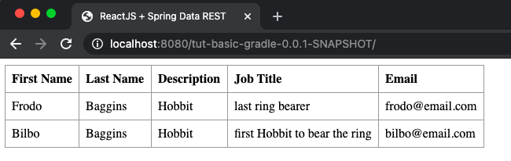
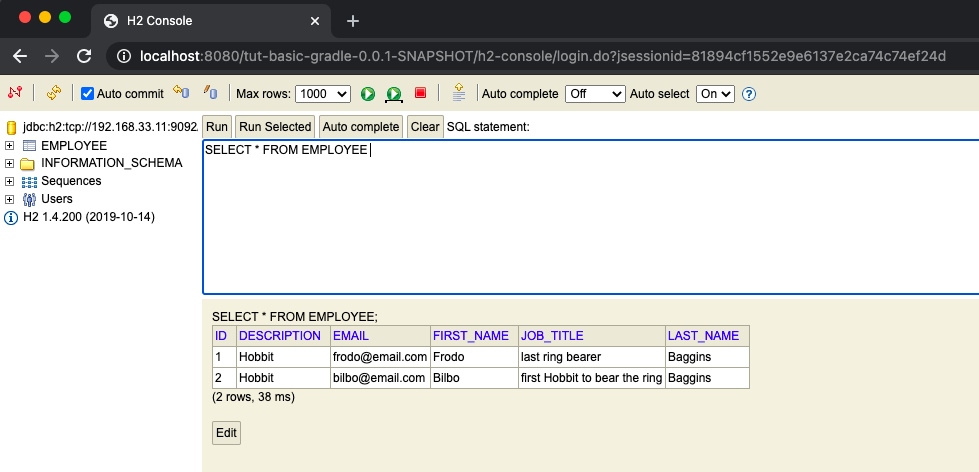
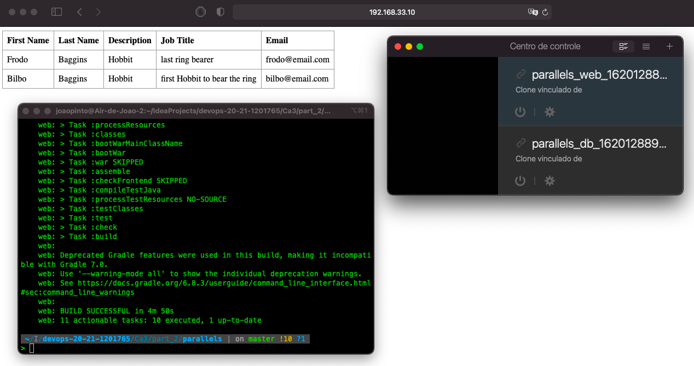

# Ca3 - Part2 - Vagrant

## 1. Initial Setup

Copy the project of Ca2 - part 2 to a new folder (Ca2/part_2/tut-basic-gradle).

At Ca2/part_2/ create a folder called virtualbox and inside create a file called Vagrantfile, without extension. The Vagrantfile content can be copy here:

[https://bitbucket.org/atb/vagrant-multi-spring-tut-demo/](https://bitbucket.org/atb/vagrant-multi-spring-tut-demo/)

To install vagrant on MacOS, using brew as the package manager, in a terminal window do:

```
$ brew install vagrant
```

## 2. Vagrantfile

### 2.1. Analysis

We can define which box we want to use using:

```
Vagrant.configure("2") do |config|
    config.vm.box = <box_name>
```

A list of box can be found here:

[boxes](https://app.vagrantup.com/boxes/search)

To use same shell commands in multiple VMs we can use:

```
    config.vm.provision "shell", inline: <<-SHELL
        <shell_commands>
    SHELL
```

We can define a VM by:

```
    config.vm.define "<vm_name>" do |<vm_name>|
        <vm_name>.vm.<config> = "<atributte>"
        [...]
    end    
```

A multiple configs can be used, like:

- box : choose box
- hostname: select hostname
- network "<network-name>", ip: <ip-addr>: network name and ip address
- networ "forwarded_port", guest: <guest-port>, host: <host-port>: port forwarding

and more...

### 2.2. How it can be used to create and provision Two Virtual Machines

Like in this example we can configure multiple VMs with one Vagrantfile, this can be used when we want to have distinct 
apps on each VM (frontend runnig on one, and database on another VM).

### 2.3. Update Vagrantfile to use Ca2 - part 2 tut-basic-gradle

In the Vagrantfile we must do some changes to use our projecto from Ca2 - part 2.

We must change the git clone command to:

```
git clone https://joaoswitch@bitbucket.org/Joao_Pinto_1201765/devops-20-21-1201765.git
```

And the change directory command:

```
cd devops-20-21-1201765/Ca3/part_2/tut-basic-gradle/
```

## 3. Update tut-basic-gradle

In this section, it will be demonstrated what needs to be changed in the tut-basic-gradle project to be used in VMs.

### 3.1. build.gradle

We must add the war plugin:

```
id 'war'
```

and to dependencies:

```
providedRuntime 'org.springframework.boot:spring-boot-starter-tomcat'
```

### 3.2. ServletInitializer

We have to create a new class at com.greglturnquist.payroll:

```
package com.greglturnquist.payroll;

import org.springframework.boot.builder.SpringApplicationBuilder;
import org.springframework.boot.web.servlet.support.SpringBootServletInitializer;

public class ServletInitializer extends SpringBootServletInitializer {

    @Override
    protected SpringApplicationBuilder configure(SpringApplicationBuilder application) {
        return application.sources(ReactAndSpringDataRestApplication.class);
    }

}
```

### 3.3. application.properties

```
server.servlet.context-path=/0.0.1-SNAPSHOT
spring.data.rest.base-path=/api
#spring.datasource.url=jdbc:h2:mem:jpadb
spring.datasource.url=jdbc:h2:tcp://192.168.33.11:9092/./jpadb;DB_CLOSE_DELAY=-1;DB_CLOSE_ON_EXIT=FALSE
spring.datasource.driverClassName=org.h2.Driver
spring.datasource.username=sa
spring.datasource.password=
spring.jpa.database-platform=org.hibernate.dialect.H2Dialect
spring.h2.console.enabled=true
spring.h2.console.path=/h2-console
spring.h2.console.settings.web-allow-others=true
spring.jpa.hibernate.ddl-auto=update
```

### 3.4. app.js

Change the path to backend api:

```
componentDidMount() { // <2>
		client({method: 'GET', path: '/tut-basic-gradle-0.0.1-SNAPSHOT/api/employees'}).done(response => {
			this.setState({employees: response.entity._embedded.employees});
		});
	}
```

## 4. Using Vagrant

In a terminal window, inside the folder that has the Vagrantfile, to start the VMs do the following command:

```
$ vagrant up
```

---
Now, we can access the front end, and the database web application in our browser:


Via localhost or the ip of the VM (http://192.168.33.10:8080/)





---

SSH into VMs, do:

```
$ vagrant ssh <vm-name>
```

To shut down VMs:

```
$ vagrant halt
```

To destroy VMs:

```
$ vagrant destroy
```

## 5. Analysis of Alternative - Parallels

Made for MacOs users, this virtualization software uses hypervisor technology, which allows the creation of VMs.

Parallels can be used to run both Linux and Windows. This software was designed for professionals, especially for programmers.

### 5.1. Advantages

- Easy to use;
- An intuitive interface;
- Fast;
- Easy set up;
- Excellent for professionals;
- No configuration needed.

### 5.2 Disadvantages

- It's paid;
- Could improve the error messages;
- Needs better handling of USB and network loss.

## 6. Implementation of Alternative

### 6.1. Installation

In order to be able to use Vagrant with Parallels, we must install the business or pro version of Parallels, as only these have integration with Vagrant.

To perform this installation, it was necessary to create an account with the institutional email and use the 14-day free trial.

After performing these steps, we can download the compatible version and login to Parallels Desktop.

### 6.2. Changes in Vagrantfile

We have to update Vagrantfile to use Parallels with provider.

Change the box, because the envimation/ubuntu-xenial dont supports parallels.

bento/ubuntu-16.04 was chosen:
```
Vagrant.configure("2") do |config|
  config.vm.box = "envimation/ubuntu-xenial"
  
  [...]
  
  config.vm.define "db" do |db|
    db.vm.box = "bento/ubuntu-16.04"
    
  [...]
  
  config.vm.define "web" do |web|
    web.vm.box = "bento/ubuntu-16.04"
```

Provider must be changed too:

```
[...]

web.vm.provider "parallels" do |v|
      v.memory = 1024
    end

[...]
```

### 6.3. vagrant up

To initialize the VMs do following command:

```
$ vagrant up --provider=parallels
```

And we can consult the resul:



## 7. References

[Virtual Box](https://www.virtualbox.org)

[Parallels](https://parallels.github.io/vagrant-parallels/docs/)

[Parallels vs VirtualBox](https://www.winxponmac.com/parallels-vs-virtualbox/)
