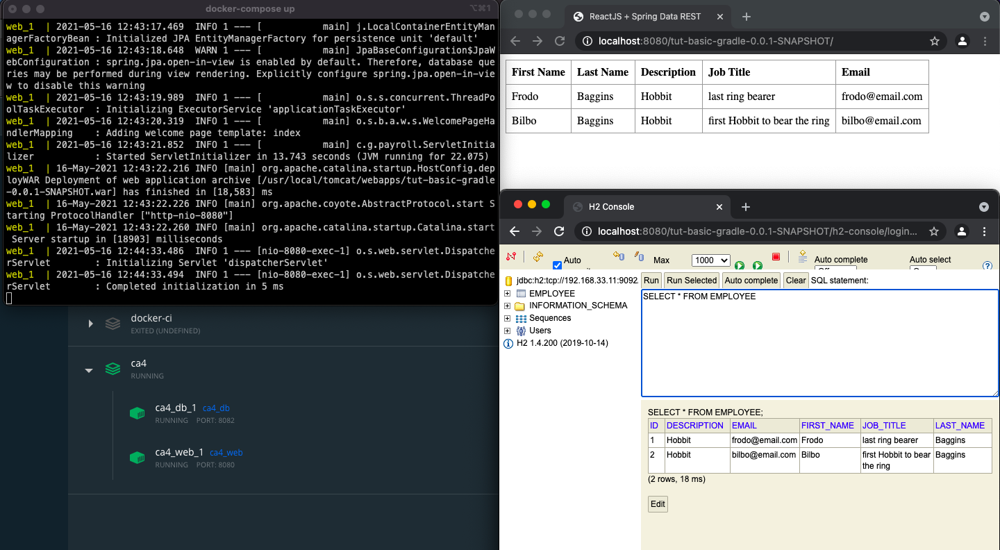

# Ca4 - Docker

## 1. Initial Setup

So let's start our docker tutorial!

### 1.1. Install Docker

To install Docker on MacOS, we must consult the following link:

[Install Docker Desktop on Mac](https://docs.docker.com/docker-for-mac/install/)

### 1.2. Setup project

After installing docker, let's move on to the project setup.

we must copy the project developed in Ca3, without the node and node-modules folders.

We must also add the gradle wrapper to the repository:

```
$ git add -f **/gradle/wrapper/gradle-wrapper.jar 
```

## 2. Dockerfile

Docker can build images automatically with a Dockerfile. It's a text file that contains all the commnands a user can call
on the command line to assemble the Docker image.

Some commands are:

|  **Command** | **What does the command do?***  |
|---------|---------|
|  FROM | Indicates the base image |
| ADD  |  Copies files from host to container  |
|  COPY | Copies files from host to container  |
|  CMD | Run a command in terminal  |
|  ENTRYPOINT |  Default aaplication |
|  ENV | Sets environment variables  |
|  EXPOSE |  Exposes a port |
|  RUN | Run a command in terminal in build fase  |
|  WORKDIR | Change working directory  |

The docker build command builds an image from a Dockerfile and a context. The build’s context is the set of files at a
specified location PATH or URL. The PATH is a directory on your local filesystem. The URL is a Git repository location.

In order to have more than one Dockerfile, you have to create folders with the name of the container you want to create,
in our example, we had to create the db folder and the web, and within each one there is the respective Dockerfile.

### 2.1. Dockerfile for db

```
FROM ubuntu

RUN apt-get update && \
  apt-get install -y openjdk-8-jdk-headless && \
  apt-get install unzip -y && \
  apt-get install wget -y

RUN mkdir -p /usr/src/app

WORKDIR /usr/src/app/

RUN wget https://repo1.maven.org/maven2/com/h2database/h2/1.4.200/h2-1.4.200.jar

EXPOSE 8082
EXPOSE 9092

CMD java -cp ./h2-1.4.200.jar org.h2.tools.Server -web -webAllowOthers -tcp -tcpAllowOthers -ifNotExists
```

### 2.2. Dockerfile for web

```
FROM tomcat

RUN apt-get update -y

RUN apt-get install -f

RUN apt-get install git -y

RUN apt-get install nodejs -y

RUN apt-get install npm -y

RUN mkdir -p /tmp/build

WORKDIR /tmp/build/

RUN git clone https://joaoswitch@bitbucket.org/Joao_Pinto_1201765/devops-20-21-1201765.git

WORKDIR /tmp/build/devops-20-21-1201765/Ca4/tut-basic-docker

RUN ./gradlew clean build

RUN cp ./build/libs/tut-basic-gradle-0.0.1-SNAPSHOT.war /usr/local/tomcat/webapps/

EXPOSE 8080
```

## 3. docker-compose.yml

Docker Compose is a tool for setup and running multi-container applications. With Compose, you use a YAML file to
configure your application’s services.
With a single command, we can create and start all services configured within docker-compose.yml.

### 3.1. Docker compose for tut-basic

At the root of Ca4 we must create a docker-compose.yml:

```
version: '3'
services:
  web:
    build: web
    ports:
      - "8080:8080"
    networks:
      default:
        ipv4_address: 192.168.33.10
    depends_on:
      - "db"
  db:
    build: db
    ports:
      - "8082:8082"
      - "9092:9092"
    volumes:
      - ./data:/usr/src/data
    networks:
      default:
        ipv4_address: 192.168.33.11
networks:
  default:
    ipam:
      driver: default
      config:
        - subnet: 192.168.33.0/24
```

### 3.2. Build image and run!

To build the images, within the folder in a terminal we can use the following command:

```
$ docker-compose build
```

And then, make it run:

```
$ docker-compose up
```

## 4. Accessing app 

Now we can go to the browser and see our app running:



## 5. Publish images to Docker Hub

To publish the images do Docker Hub, first we need to tag the images:

```
$ docker tag <image-name> <Docker-Hub-Name>/<image-name>
```

And then push to remote repository:

```
$ docker push <Docker-Hub-Name>/<image-name>
```

We can access the images:

[ca4_db](https://hub.docker.com/r/joaopintodev/ca4_db)

[ca4_web](https://hub.docker.com/r/joaopintodev/ca4_web)

## 6. Using volumes

Volumes are the preferred mechanism for persisting the data generated and used by Docker containers, the volumes are 
fully managed by Docker. A volume does not increase the size of the containers that use it, and the content of the volume
exists outside the life cycle of a given container.

### 6.1. Copy files inside container to volume

To get a copy of the database file by using the exec command to run a shell in the container use:

```
$ docker exec -it <container-id> cp jpadb.mv.db /usr/src/data
```

The volume was set in docker-compose.yml:

```
    volumes:
          - ./data:/usr/src/data
```

## 7. Analysis of Alternative - Heroku

### 7.1. What is Heroku?

### 7.2. How Heroku Works?

## 8. Implementation of Alternative

### 8.1. Create Account and Install Heroku

### 8.2. Prepare project to deploy

### 8.3. Create an App at Heroku.com

### 8.4. Deploy

### 8.5. Connect with an external database

### 8.5.1. Create database schema

### 8.5.2. Postgre connection and setup

### 8.5.3. Changes to application.properties

### 8.5.4. Deploy

```
heroku plugins:install java 
```

```
 heroku war:deploy /Users/joaopinto/IdeaProjects/devops-20-21-1201765/Ca4/tut-basic-heroku/build/libs/tut-basic-gradle-0.0.1-SNAPSHOT.war --app devops-20-21-1201765

```

## 9. References

[Dockerfile](https://docs.docker.com/engine/reference/builder/)
[Docker Compose](https://docs.docker.com/compose/)
[War deployment](https://devcenter.heroku.com/articles/war-deployment)