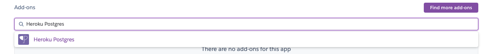

# Ca4 - Docker

## 1. Initial Setup

So let's start our docker tutorial!

### 1.1. Install Docker

To install Docker on MacOS, we must consult the following link:

[Install Docker Desktop on Mac](https://docs.docker.com/docker-for-mac/install/)

### 1.2. Setup project

After installing docker, let's move on to the project setup.

we must copy the project developed in Ca3, without the node and node-modules folders.

We must also add the gradle wrapper to the repository:

```
$ git add -f **/gradle/wrapper/gradle-wrapper.jar 
```

## 2. Dockerfile

Docker can build images automatically with a Dockerfile. It's a text file that contains all the commnands a user can call
on the command line to assemble the Docker image.

Some commands are:

|  **Command** | **What does the command do?***  |
|---------|---------|
|  FROM | Indicates the base image |
| ADD  |  Copies files from host to container  |
|  COPY | Copies files from host to container  |
|  CMD | Run a command in terminal  |
|  ENTRYPOINT |  Default aaplication |
|  ENV | Sets environment variables  |
|  EXPOSE |  Exposes a port |
|  RUN | Run a command in terminal in build fase  |
|  WORKDIR | Change working directory  |

The docker build command builds an image from a Dockerfile and a context. The build’s context is the set of files at a
specified location PATH or URL. The PATH is a directory on your local filesystem. The URL is a Git repository location.

In order to have more than one Dockerfile, you have to create folders with the name of the container you want to create,
in our example, we had to create the db folder and the web, and within each one there is the respective Dockerfile.

### 2.1. Dockerfile for db

```
FROM ubuntu

RUN apt-get update && \
  apt-get install -y openjdk-8-jdk-headless && \
  apt-get install unzip -y && \
  apt-get install wget -y

RUN mkdir -p /usr/src/app

WORKDIR /usr/src/app/

RUN wget https://repo1.maven.org/maven2/com/h2database/h2/1.4.200/h2-1.4.200.jar

EXPOSE 8082
EXPOSE 9092

CMD java -cp ./h2-1.4.200.jar org.h2.tools.Server -web -webAllowOthers -tcp -tcpAllowOthers -ifNotExists
```

### 2.2. Dockerfile for web

```
FROM tomcat

RUN apt-get update -y

RUN apt-get install -f

RUN apt-get install git -y

RUN apt-get install nodejs -y

RUN apt-get install npm -y

RUN mkdir -p /tmp/build

WORKDIR /tmp/build/

RUN git clone https://joaoswitch@bitbucket.org/Joao_Pinto_1201765/devops-20-21-1201765.git

WORKDIR /tmp/build/devops-20-21-1201765/Ca4/tut-basic-docker

RUN ./gradlew clean build

RUN cp ./build/libs/tut-basic-gradle-0.0.1-SNAPSHOT.war /usr/local/tomcat/webapps/

EXPOSE 8080
```

## 3. docker-compose.yml

Docker Compose is a tool for setup and running multi-container applications. With Compose, you use a YAML file to
configure your application’s services.
With a single command, we can create and start all services configured within docker-compose.yml.

### 3.1. Docker compose for tut-basic

At the root of Ca4 we must create a docker-compose.yml:

```
version: '3'
services:
  web:
    build: web
    ports:
      - "8080:8080"
    networks:
      default:
        ipv4_address: 192.168.33.10
    depends_on:
      - "db"
  db:
    build: db
    ports:
      - "8082:8082"
      - "9092:9092"
    volumes:
      - ./data:/usr/src/data
    networks:
      default:
        ipv4_address: 192.168.33.11
networks:
  default:
    ipam:
      driver: default
      config:
        - subnet: 192.168.33.0/24
```

### 3.2. Build image and run!

To build the images, within the folder in a terminal we can use the following command:

```
$ docker-compose build
```

And then, make it run:

```
$ docker-compose up
```

## 4. Accessing app 

Now we can go to the browser and see our app running:


## 5. Publish images to Docker Hub

To publish the images do Docker Hub, first we need to tag the images:

```
$ docker tag <image-name> <Docker-Hub-Name>/<image-name>
```

And then push to remote repository:

```
$ docker push <Docker-Hub-Name>/<image-name>
```

We can access the images:

**[ca4_db](https://hub.docker.com/r/joaopintodev/ca4_db)**

**[ca4_web](https://hub.docker.com/r/joaopintodev/ca4_web)**

## 6. Using volumes

Volumes are the preferred mechanism for persisting the data generated and used by Docker containers, the volumes are 
fully managed by Docker. A volume does not increase the size of the containers that use it, and the content of the volume
exists outside the life cycle of a given container.

### 6.1. Copy files inside container to volume

To get a copy of the database file by using the exec command to run a shell in the container use:

```
$ docker exec -it <container-id> cp jpadb.mv.db /usr/src/data
```

The volume was set in docker-compose.yml:

```
    volumes:
          - ./data:/usr/src/data
```

## 7. Analysis of Alternative - Heroku

### 7.1. What is Heroku?

Heroku is a cloud platform that enables companies to spend less time worried about infrastructure and deploying apps
that immediately start producing value.

### 7.2. How Heroku Works?

Heroku allows you to deploy applications in several languages.

Whatever the type of application, it will not be necessary to change the code to be able to be run by Heroku.
It is only necessary to inform which part of the application is executable (defined in the Procfile file at the root
of the project).

Heroku allows you to deploy via various platforms or tools, such as Git, Github, Hashicorp Terraform, War deployment
or Docker-based deployments.

In general, Heroku is an easy-to-use tool and there is a lot of documentation to help with its application.

## 8. Implementation of Alternative

In this section, the steps for implementing the solution through Heroku will be described.

The deployment method used is WAR deployment.

### 8.1. Create Account and Install Heroku

First of all, we must create an account on heroku, through this link:

[heroku.com](https://www.heroku.com)

As my operating system is Mac OS, for the installation of Heroku, the following command was used:

```
brew tap heroku/brew && brew install heroku
```

The rest of the alternatives can be found [here](https://devcenter.heroku.com/articles/heroku-cli).

### 8.2. Prepare project to deploy

**The first implementation will use a database in memory in the container deployed in Heroku.**

### 8.2.1. Procfile
For heroku to know which file will be executed, we have to create a text file called Procfile without extension
that must contain:

```
web java $JAVA_OPTS -jar webapp-runner.jar ${WEBAPP_RUNNER_OPTS} --port $PORT ./build/libs/tut-basic-gradle-0.0.1-SNAPSHOT.war
```

### 8.2.2. app.js

We must make changes so that http requests are correctly made:

```
	componentDidMount() { // <2>
		client({method: 'GET', path: '/api/employees'}).done(response => {
			this.setState({employees: response.entity._embedded.employees});
		});
	}
```

### 8.2.3. application.properties

In the application.properties we have to enable the database in memory again:

```
...
spring.datasource.url=jdbc:h2:mem:jpadb
#spring.datasource.url=jdbc:h2:tcp://192.168.33.11:9092/./jpadb;DB_CLOSE_DELAY=-1;DB_CLOSE_ON_EXIT=FALSE
...
```

### 8.3. Create an App at Heroku.com

The process of creating an application is simple, just choose a name!


### 8.4. Deploy

So let's take care of the build and deploy!

In the terminal, at the base of the project we will log in to Heroku:

```
$ heroku login
```

Next, let's build the project:

```
$ ./gradlew build
```

To deploy the war file created in the build we have to install the Heroku Java CLI plugin:

```
$ heroku plugins:install java
```

Now we just need to deploy!

```
$ heroku war:deploy <path_to_war_file> --app <app_name>
```

### 8.5. Live

The site is live here:

[https://devops-20-21-1201765.herokuapp.com](https://devops-20-21-1201765.herokuapp.com)

### 8.6. Connect with an external database

Now we are going to deploy another application, but this time we will use a database that is in an aws container.

The database used was Postgres, as Heroku has a free plugin, which provides a database hosted on an instance of aws.

### 8.6.1. Create database schema

We will need to generate the database schema so that we can enter it directly into the database, so we add the following
content to the application.properties file and run the application. It will generate a file called create.sql that will
contain the commands for the database setup.

```
...
spring.jpa.properties.javax.persistence.schema-generation.create-source=metadata
spring.jpa.properties.javax.persistence.schema-generation.scripts.action=create
spring.jpa.properties.javax.persistence.schema-generation.scripts.create-target=create.sql
spring.jpa.properties.hibernate.hbm2ddl.delimiter=;
```

The generated file must contain:

```
create sequence hibernate_sequence start with 1 increment by 1;
create table employee (id bigint not null, description varchar(255), email varchar(255), first_name varchar(255), job_title varchar(255), last_name varchar(255), primary key (id));
```

### 8.6.2. Postgres connection and setup

Now, on heroku.com within the application we are going to add the Heroku Postgres add-on. The option is found on the
Resources page.



Now we go to Settings, and we show the Config Var, the link of the database will be shown.


Let's copy the link and decompose it, so that we can access the database through pgAdmin 4 (instructions for its
installation can be found [here](https://www.pgadmin.org/download/)).


In pgAdmin 4 we must create a new server and fill in according to the following images (the names are based on the
decomposed link).


Then, we open the query tool and run the commands created and contained in the create.sql file.


### 8.6.3. Changes to application.properties

In the application.properties file, we should comment out everything that is not necessary and define the url of the
data source with the environment variable found in the Heroku container.
This will make use of the environment variable that contains the database url.

```
spring.datasource.url=${DATABASE_URL}
```

### 8.6.4. Changes to build.gradle

In the dependencies of build.gradle you have to add the dependencies of postgres and spring jbdc, and comment on the dependency for H2:

```
dependencies {
    implementation 'org.springframework.boot:spring-boot-starter-data-jpa'
    implementation 'org.springframework.boot:spring-boot-starter-data-rest'
    implementation 'org.springframework.boot:spring-boot-starter-thymeleaf'
    //runtimeOnly 'com.h2database:h2'
    testImplementation 'org.springframework.boot:spring-boot-starter-test'
    providedRuntime 'org.springframework.boot:spring-boot-starter-tomcat'
    // https://mvnrepository.com/artifact/org.springframework.boot/spring-boot-starter-jdbc
    implementation group: 'org.springframework.boot', name: 'spring-boot-starter-jdbc', version: '2.4.5'
    // https://mvnrepository.com/artifact/org.postgresql/postgresql
    implementation group: 'org.postgresql', name: 'postgresql', version: '42.2.18'
}
```

### 8.6.5. Deploy

Finally, we build and deploy again:

```
$ ./gradlew build
```

```
$ heroku war:deploy <path_to_war_file> --app <app_name>
```

If the Gods had us, the app will go online and make use of the external database.


### 8.7. Live with Postgres

The site is live here:

[https://devops-20-21-1201765-postgres.herokuapp.com](https://devops-20-21-1201765-postgres.herokuapp.com)

As we have the application with the free plan, if it is not used for 30 minutes it goes into hibernation, taking
a while to start again when there is a new order. In our case, when the application is booted, two employees are added,
so at the moment I took the screenshot there are already 6.


## 9. References

[Dockerfile](https://docs.docker.com/engine/reference/builder/)

[Docker Compose](https://docs.docker.com/compose/)

[Devcenter - Heroku](https://devcenter.heroku.com/articles/how-heroku-works)

[War deployment](https://devcenter.heroku.com/articles/war-deployment)