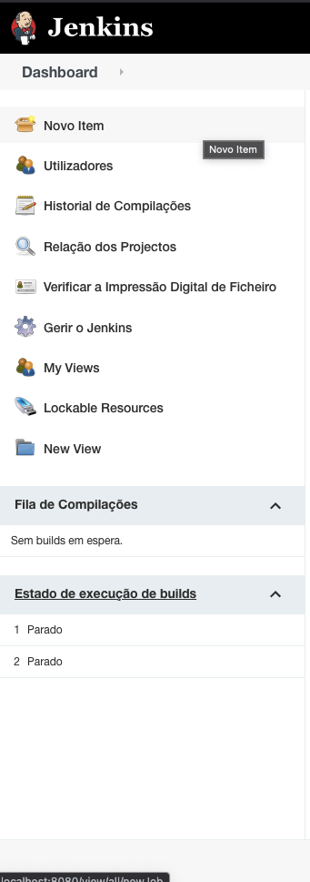
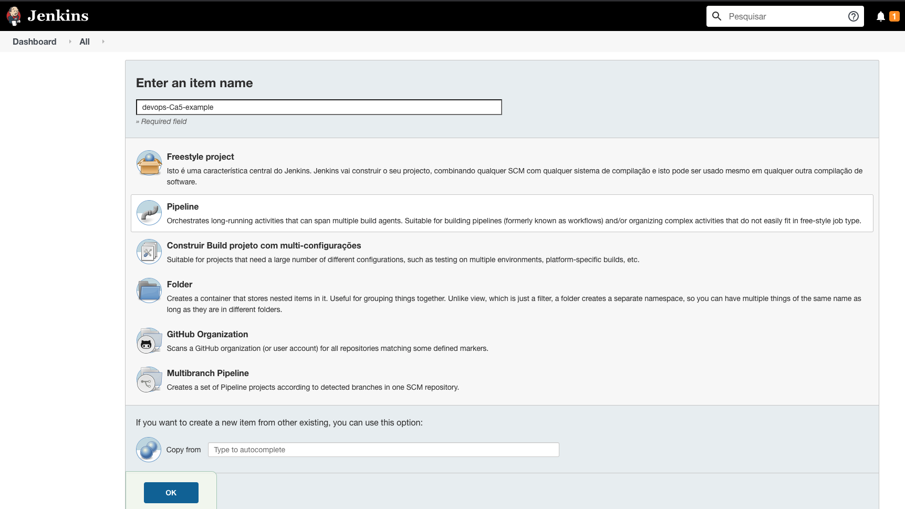
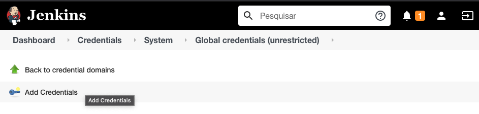
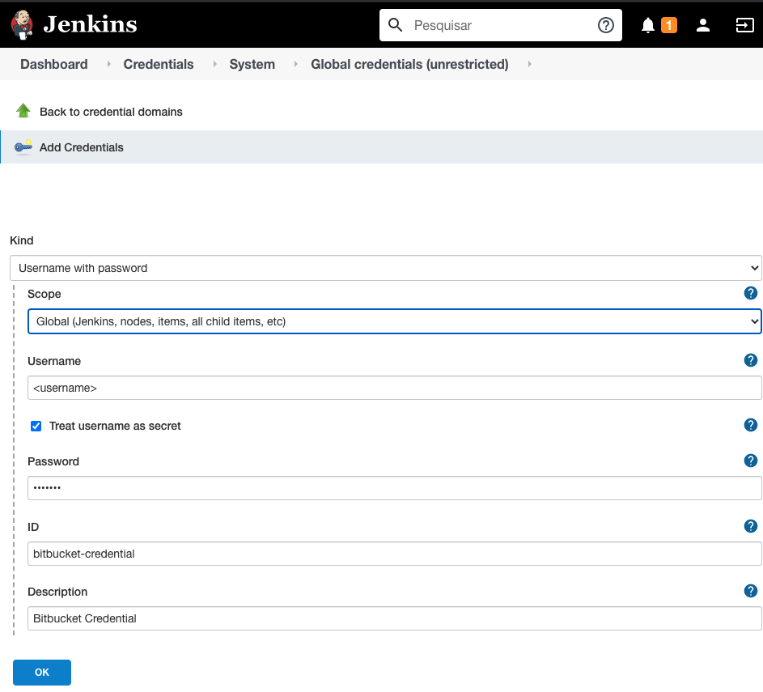
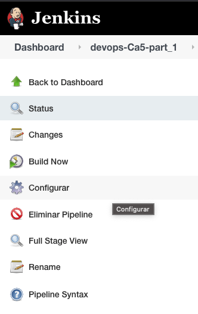
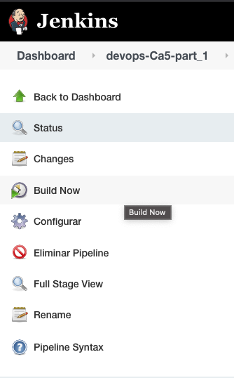
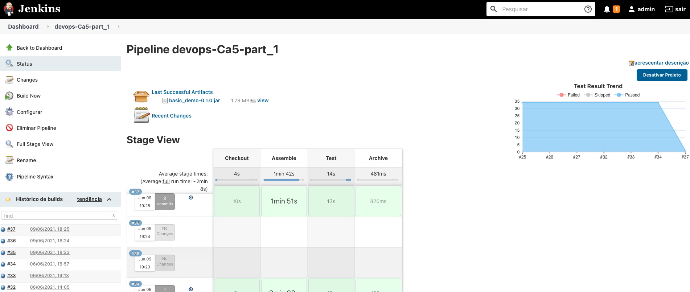
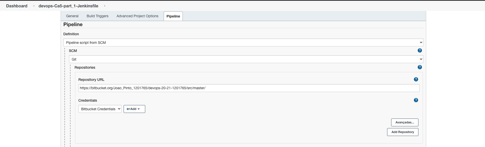
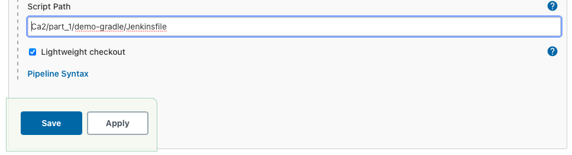
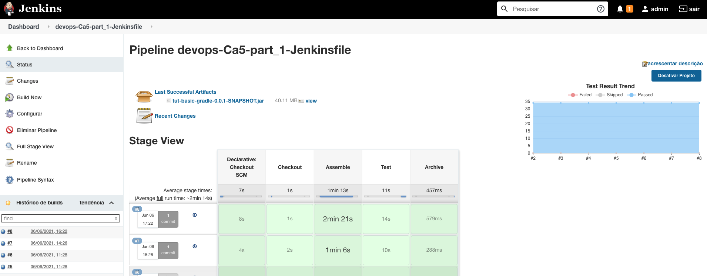

# Ca5 - part 1 - Jenkins

So let's start our Jenkins tutorial!

## 1. Setup, using Jenkins in a docker image

For this tutorial we used an official docker image containing Jenkins.

It is only necessary to run the following command:

```
$ docker run -d -p 8080:8080 -p 50000:50000 jenkins/jenkins:lts-jdk11
```

For information to add about the image you can consult the following 
[repository](https://github.com/jenkinsci/docker/blob/master/README.md) on GitHub.

If you run the command in the detached mode "-d", at the end of the image download and initialization it is necessary to
run the following command to have access to the initial password of the Jenkins server:

```
$ docker exec <container_name> cat /var/jenkins_home/secrets/initialAdminPassword
```

Next, we access localhost:8080, introduce the password we got with the previous command, install the default plugins and
create a user with a password so that we can use the server.

## 2. Create a new job

Now let's create a new pipeline job, click on new item, then give the new project a name and choose Pipeline mode and
then hit okay.




## 3. Add Credentials

As the repository is private, it is necessary to send the access credentials to access the source code, but it is not
advisable to have the username and password hard coded in the pipeline or in the repository, so we have to create
credentials on the Jenkins server, which will be sent during the interaction with the remote repository.

So we go to Manage Jenkins/Credentials/System/Global credentials (unrestricted) and click on Add Credentials.

We introduce the access data to the remote repository, and save the id to put in the pipeline.




## 4. Jenkins Pipeline

Let's configure our Pipeline, accessing the configuration and in the pipeline section choose Pipeline script.




The initial layout of the pipeline was as follows:

```
pipeline {
    
    agent any
    
    stages {
        
        stage("Checkout") {
            steps{
                echo 'Checkout'
            }
        }
        
        stage("Assemble") {
            steps{
                echo 'Assemble'
            }
        }
    
        stage("Test") {
            steps{
                echo 'Test'
            }
        }
        
        stage("Archive") {
            steps{
                echo 'Archive'
            }
        }
        
    }
}
```

Afterwards, the following changes were added.

### 4.1. Checkout

We now need the id of the previously created credentials and the url of the remote repository for the server to be able
to checkout.

```
...
        stage("Checkout") {
            steps{
                git credentialsId: 'bitbucket-credentials', url: 'https://bitbucket.org/Joao_Pinto_1201765/devops-20-21-1201765/src/master/'
            }
        }
...
```

### 4.2. Assemble

For the Assemble stage, the gradle assemble command was used to generate the .jar file instead of the gradle build to
run the tests on the next stage.

For this tutorial we used the project located in the folder Ca2/part_2/tut-basic-gradle/, so to run commands outside the
root of the project we have to use the following block:

```
    dir(<intedend-folder>){
        // comands
       
    }
```

A script block was also added, to run different commands, depending on the operating system where the Jenkins server is
running, Unix like or Windows.

```
...
        stage("Assemble") {
            steps{
                echo 'Assemble'
                
                dir('Ca2/part_2/tut-basic-gradle/'){
                    script {
                        if(isUnix() == true) {
                            sh './gradlew clean assemble'
                        } else {
                            bat './gradlew clean assemble'
                        }
                    }
                    
                }
            }
        }
...
```

### 4.3. Test

In stage Test, we will use the gradle test to run the tests and the JUnit step to publish the test results.

```
...
        stage("Test") {
            steps{
                echo 'Test'
                dir('Ca2/part_2/tut-basic-gradle/'){
                    script{
                        if (isUnix() == true) {
                            sh './gradlew test'
                        } else {
                            bat './gradlew test'
                        }
                    }
                    junit 'build/test-results/**/*.xml'
                }
            }
        }
...
```

### 4.4. Archive

Finally, on the Archive stage, the archiveArtifacts step was used to archive the .jar file generated when running the
gradle assemble.

```
...
        stage("Archive") {
            steps{
                echo 'Archive'
                dir('Ca2/part_2/tut-basic-gradle/'){
                    archiveArtifacts artifacts: 'build/libs/**/*.jar'    
                }
            }
        }
...
```

### 4.5. Final Pipeline Script

```
pipeline {
    
    agent any
    
    stages {
        
        stage("Checkout") {
            steps{
                git credentialsId: 'bitbucket-credentials', url: 'https://bitbucket.org/Joao_Pinto_1201765/devops-20-21-1201765/src/master/'
            }
        }
        
        stage("Assemble") {
            steps{
                echo 'Assemble'
                
                dir('Ca2/part_2/tut-basic-gradle/'){
                    script {
                        if(isUnix() == true) {
                            sh './gradlew clean assemble'
                        } else {
                            bat './gradlew clean assemble'
                        }
                    }
                    
                }
            }
        }
    
        stage("Test") {
            steps{
                echo 'Test'
                dir('Ca2/part_2/tut-basic-gradle/'){
                    script{
                        if (isUnix() == true) {
                            sh './gradlew test'
                        } else {
                            bat './gradlew test'
                        }
                    }
                    junit 'build/test-results/**/*.xml'
                }
            }
        }
        
        stage("Archive") {
            steps{
                echo 'Archive'
                dir('Ca2/part_2/tut-basic-gradle/'){
                    archiveArtifacts artifacts: 'build/libs/**/*.jar'    
                }
            }
        }
        
    }
}
```

Hit save and let's build!



### 4.6. After build view



## 5. build from Jenkinsfile

To use a Pipeline script that is in the remote repository, we have to create a file called Jenkinsfile without
extension, and put the Pipeline that was previously developed in it (same as it is in 4.5. section).

As we were using the project Ca2/part_2/tut-basic-gradle the Jenkinsfile was created in that folder.

Now let's create a new job, just like the one created in point 2., but in the definition choose Pipeline script from
SCM, it is necessary to put the url of the remote repository and the access credentials:



In the Script Path we must put the path to access the Jenkinsfile, which in our case is found in
Ca2/part_2/tut-basic-gradle/Jenkinsfile:



Now we can save, and if the Gods are with us, the build will run smooth and flawless.



## 6. References

https://turkogluc.com/build-and-deploy-gradle-projects-with-jenkins/

https://stackoverflow.com/questions/44185165/what-are-the-differences-between-gradle-assemble-and-gradle-build-tasks

https://www.jenkins.io/doc/pipeline/tour/tests-and-artifacts/