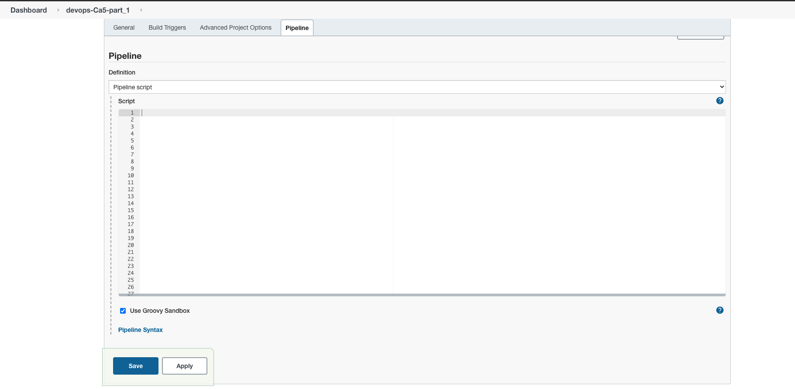
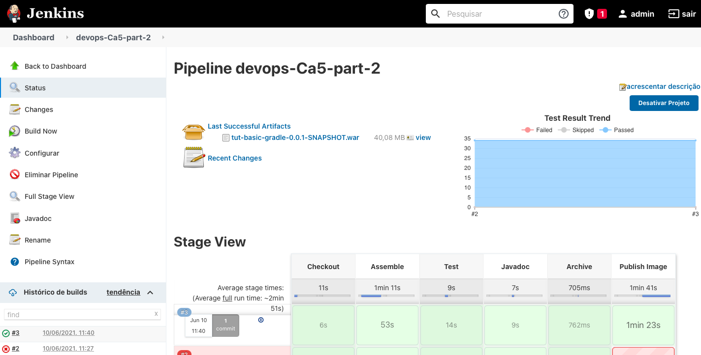
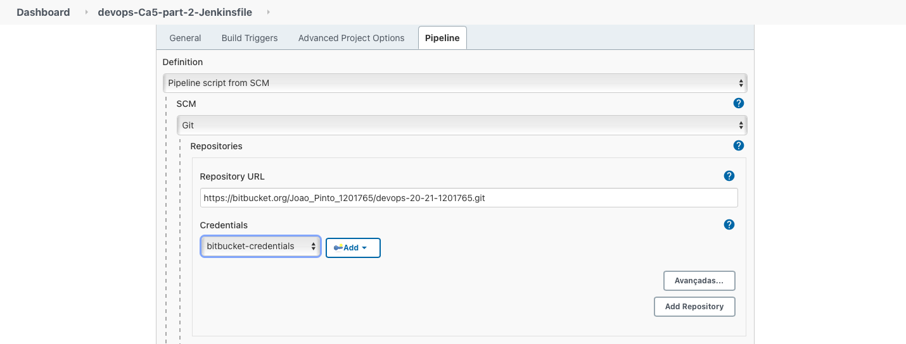
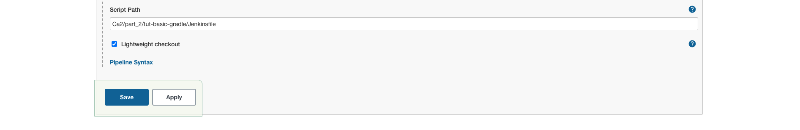
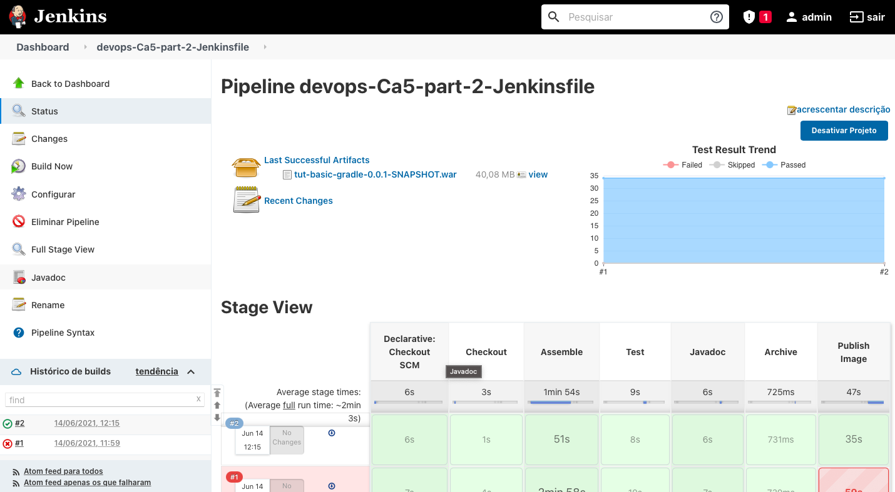

# Ca5 - part 2 - Jenkins

So let's start our second Jenkins tutorial!

This time we're going to start right away, and then the project developed in Ca2/part_2 will be used.

## 1. Initial Setup

The initial setup is the same as that carried out in Ca5/part_2 (steps 1. 2. and 3.), and can be found 
[here](../part_1/README.md)!

## 2. Jenkins Pipeline

### 2.1 Initial Layout

Let's configure our Pipeline, accessing the configuration and in the pipeline section choose Pipeline script.



The initial layout of the pipeline was as follows:

```
pipeline {
    
    agent any
    
    stages {
        
        stage("Checkout") {
            steps{
                echo 'Checkout'
            }
        }
        
        stage("Assemble") {
            steps{
                echo 'Assemble'
            }
        }
    
        stage("Test") {
            steps{
                echo 'Test'
            }
        }
        
        stage("Javadoc") {
            steps{
                echo 'Javadoc'
            }
        }
        
        stage("Archive") {
            steps{
                echo 'Archive'
            }
        }
        
        stage("Publish Image") {
            steps{
                echo 'Publish Image'
            }
        }
    }
}
```

Afterwards, the following changes were added.

### 2.2. Checkout

We now need the id of the previously created credentials and the url of the remote repository for the server to be able
to checkout.

```
...
        stage("Checkout") {
            steps{
                git credentialsId: 'bitbucket-credentials', url: 'https://bitbucket.org/Joao_Pinto_1201765/devops-20-21-1201765/src/master/'
            }
        }
...
```

### 2.3. Assemble

For the Assemble stage, the gradle assemble command was used to generate the .jar file instead of the gradle build to
run the tests on the next stage.

For this tutorial we used the project located in the folder Ca2/part_2/tut-basic-gradle/, so to run commands outside the
root of the project we have to use the following block:

```
    dir(<intedend-folder>){
        // comands
       
    }
```

A script block was also added, to run different commands, depending on the operating system where the Jenkins server is
running, Unix like or Windows.

```
...
        stage("Assemble") {
            steps{
                echo 'Assemble'
                
                dir('Ca2/part_2/tut-basic-gradle/'){
                    script {
                        if(isUnix() == true) {
                            sh './gradlew clean assemble'
                        } else {
                            bat './gradlew clean assemble'
                        }
                    }
                    
                }
            }
        }
...
```

### 2.4. Test

In stage Test, we will use the gradle test to run the tests and the JUnit step to publish the test results.

```
...
        stage("Test") {
            steps{
                echo 'Test'
                dir('Ca2/part_2/tut-basic-gradle/'){
                    script{
                        if (isUnix() == true) {
                            sh './gradlew test'
                        } else {
                            bat './gradlew test'
                        }
                    }
                    junit 'build/test-results/**/*.xml'
                }
            }
        }
...
```

### 2.5. Javadoc

build.gradle
```
javadoc {
    classpath += sourceSets.main.compileClasspath
    source += sourceSets.main.allJava
}
```


### 2.6. Archive

On the Archive stage, the archiveArtifacts step was used to archive the .jar file generated when running the
gradle assemble.

```
...
        stage("Archive") {
            steps{
                echo 'Archive'
                dir('Ca2/part_2/tut-basic-gradle/'){
                    archiveArtifacts artifacts: 'build/libs/**/*.jar'    
                }
            }
        }
...
```

### 2.7. Publish Image


### 2.8. Final Pipeline Script

```
pipeline {
    
    agent any
    
    stages {
        
        stage("Checkout") {
            steps{
                git credentialsId: 'bitbucket-credentials', url: 'https://bitbucket.org/Joao_Pinto_1201765/devops-20-21-1201765/src/master/'
            }
        }
        
        stage("Assemble") {
            steps{
                echo 'Assemble'
                
                dir('Ca2/part_2/tut-basic-gradle/'){
                    script {
                        if(isUnix() == true) {
                            sh './gradlew clean assemble'
                        } else {
                            bat './gradlew clean assemble'
                        }
                    }
                    
                }
            }
        }
    
        stage("Test") {
            steps{
                echo 'Test'
                dir('Ca2/part_2/tut-basic-gradle/'){
                    script{
                        if (isUnix() == true) {
                            sh './gradlew test'
                        } else {
                            bat './gradlew test'
                        }
                    }
                    junit 'build/test-results/**/*.xml'
                }
            }
        }
        
        stage("Archive") {
            steps{
                echo 'Archive'
                dir('Ca2/part_2/tut-basic-gradle/'){
                    archiveArtifacts artifacts: 'build/libs/**/*.jar'    
                }
            }
        }
        
    }
}
```

Hit save and let's build!


### 4.6. After build view



## 5. build from Jenkinsfile

To use a Pipeline script that is in the remote repository, we have to create a file called Jenkinsfile without
extension, and put the Pipeline that was previously developed in it (same as it is in 4.5. section).

As we were using the project Ca2/part_2/tut-basic-gradle the Jenkinsfile was created in that folder.

Now let's create a new job, just like the one created in point 2., but in the definition choose Pipeline script from
SCM, it is necessary to put the url of the remote repository and the access credentials:



In the Script Path we must put the path to access the Jenkinsfile, which in our case is found in
Ca2/part_2/tut-basic-gradle/Jenkinsfile:



Now we can save, and if the Gods are with us, the build will run smooth and flawless.



## 6. References

https://turkogluc.com/build-and-deploy-gradle-projects-with-jenkins/

https://stackoverflow.com/questions/44185165/what-are-the-differences-between-gradle-assemble-and-gradle-build-tasks

https://www.jenkins.io/doc/pipeline/tour/tests-and-artifacts/

docker run -it --name teamcity-server-instance  \
    -v <path-to-data-directory>:/data/teamcity_server/datadir \
    -v <path-to-logs-directory>:/opt/teamcity/logs  \
    -p <port-on-host>:8111 \
    jetbrains/teamcity-server

https://hub.docker.com/r/jetbrains/teamcity-server/

https://blog.jetbrains.com/teamcity/2019/03/configuration-as-code-part-2-working-with-kotlin-scripts/

https://www.overops.com/blog/jenkins-vs-travis-ci-vs-circle-ci-vs-teamcity-vs-codeship-vs-gitlab-ci-vs-bamboo/

https://medium.com/@sergedevelops/getting-started-with-pipeline-as-code-using-kotlin-and-teamcity-236ecb8ed6e

https://www.jetbrains.com/help/teamcity/jenkins-to-teamcity-migration-guidelines.html#Build

https://www.jetbrains.com/teamcity/

