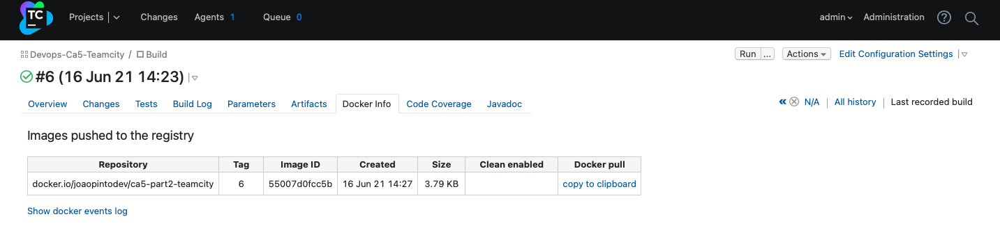

# Ca5 - part 2 - Jenkins

So let's start our second Jenkins tutorial!

This time we're going to start right away, and then the project developed in Ca2/part_2 will be used.

## 1. Initial Setup

### Important warning

In the first attempt at implementation, the container used in Ca5 part 1 was used, but I had difficulty using the docker
engine present on the host (due to permissions issues), so in this part the Jenkins war file was used!

## 1.1. Jenkins war file

To use jenkins from the war file is as simple as downloading it, and from the command line, in the folder where it
was placed, run the following command:

```
$ java -jar jenkins.war
```

Optionally we can specify the port:

```
$ java -jar jenkins.war --httpPort=<port_number>
```

Make sure your machine is running jdk11, my first attempt was using jdk16 and had to change it using skd (Software
Development Kit Manager).

## 1.2. Create a new job and Add Credentials

To Create a new job and Add Credentials follow the steps carried out in Ca5/part_2 (steps 2. and 3.), and can be found 
[here](../part_1/README.md)!

## 2. Jenkins Pipeline

### 2.1 Initial Layout

Let's configure our Pipeline, accessing the configuration and in the pipeline section choose Pipeline script.


The initial layout of the pipeline was as follows:

```
pipeline {
    
    agent any
    
    stages {
        
        stage("Checkout") {
            steps{
                echo 'Checkout'
            }
        }
        
        stage("Assemble") {
            steps{
                echo 'Assemble'
            }
        }
    
        stage("Test") {
            steps{
                echo 'Test'
            }
        }
        
        stage("Javadoc") {
            steps{
                echo 'Javadoc'
            }
        }
        
        stage("Archive") {
            steps{
                echo 'Archive'
            }
        }
        
        stage("Publish Image") {
            steps{
                echo 'Publish Image'
            }
        }
    }
}
```

Afterwards, the following changes were added.

### 2.2. Checkout

We now need the id of the previously created credentials and the url of the remote repository for the server to be able
to checkout.

```
...
        stage("Checkout") {
            steps{
                git credentialsId: 'bitbucket-credentials', url: 'https://bitbucket.org/Joao_Pinto_1201765/devops-20-21-1201765/src/master/'
            }
        }
...
```

### 2.3. Assemble

For the Assemble stage, the gradle assemble command was used to generate the .war file instead of the gradle build to
run the tests on the next stage.

It was also necessary to add the plugin that generates the war file in build.gradle:

```
plugins {
    [...]
    id 'war'
}
```

For this tutorial we used the project located in the folder Ca2/part_2/tut-basic-gradle/, so to run commands outside the
root of the project we have to use the following block:

```
    dir(<intedend-folder>){
        // comands
       
    }
```

A script block was also added, to run different commands, depending on the operating system where the Jenkins server is
running, Unix like or Windows.

```
...
        stage("Assemble") {
            steps{
                echo 'Assemble'
                
                dir('Ca2/part_2/tut-basic-gradle/'){
                    script {
                        if(isUnix() == true) {
                            sh './gradlew clean assemble'
                        } else {
                            bat './gradlew clean assemble'
                        }
                    }
                    
                }
            }
        }
...
```

### 2.4. Test

In stage Test, we will use the gradle test to run the tests and the JUnit step to publish the test results.

```
...
        stage("Test") {
            steps{
                echo 'Test'
                dir('Ca2/part_2/tut-basic-gradle/'){
                    script{
                        if (isUnix() == true) {
                            sh './gradlew test'
                        } else {
                            bat './gradlew test'
                        }
                    }
                    junit 'build/test-results/**/*.xml'
                }
            }
        }
...
```

### 2.5. Javadoc

For the stage of generating the javadocs it was necessary to add the classpath and the source to the javadoc task of the
gradle, adding the following to the build.gradle:

```
javadoc {
    classpath += sourceSets.main.compileClasspath
    source += sourceSets.main.allJava
}
```

To publish the generated html it is necessary to install the plugin HTML Publisher on the page to manage the plugins.


In the pipeline, the Javadoc stage will look like this:

```
...
        stage("Javadoc") {
            steps{
                echo 'Javadoc'
                dir('Ca2/part_2/tut-basic-gradle/'){
                    script{
                        if (isUnix() == true) {
                            sh './gradlew javadoc'
                        } else {
                            bat './gradlew javadoc'
                        }
                    }
                    publishHTML (target: [
                        keepAll: true,
                        reportDir: 'build/docs/javadoc/',
                        reportFiles: 'index.html',
                        reportName: 'Javadoc'
                  ])
                }
            }
        }
...
```

In the project menu a new icon will appear, called Javadoc, which will take us to the generated index.html.


### 2.6. Archive

On the Archive stage, the archiveArtifacts step was used to archive the .war file generated when running the
gradle assemble.

```
...
        stage("Archive") {
            steps{
                echo 'Archive'
                dir('Ca2/part_2/tut-basic-gradle/'){
                    archiveArtifacts artifacts: 'build/libs/**/*.war'    
                }
            }
        }
...
```

### 2.7. Publish Image

To build a docker image from a Jenkins pipeline, we first need to install the Docker Pipeline plugin.


Next, just like we did with the remote repository credentials, we need to add the Docker Hub access credentials.


We also have to create a new repository in the docker hub to push the created images.


To build using a Dockerfile, it is necessary to add a Dockerfile to the Ca2/part_2/tut-basic-gradle folder, with the
following content:

```
FROM tomcat

RUN apt-get update -y

RUN apt-get install -f

RUN apt-get install git -y

RUN apt-get install nodejs -y

RUN apt-get install npm -y

ADD /build/libs/tut-basic-gradle-0.0.1-SNAPSHOT.war /usr/local/tomcat/webapps/

EXPOSE 8080
```

The Dockerfile will copy the war file generated on the Assemble stage to the /usr/local/tomcat/webapps/ folder inside
the image, thus avoiding the need to rebuild the project when building the image.

Finally, in the pipeline we will add the Publish Image stage, adding the environment (with the necessary data for the
image push) and the part of the stage itself:

```
pipeline {
    environment {
        registry = 'joaopintodev/ca5-part2-jenkins'
        registryCredential = 'docker-hub_credentials'
        dockerImage = ''
    }
    
    [...]
    
    stage("Publish Image") {
            steps{
                echo 'Publish Image'
                dir('Ca2/part_2/tut-basic-gradle/'){
                    script{
                        dockerImage = docker.build registry + ":$BUILD_NUMBER"
                        docker.withRegistry( '', registryCredential ) {
                            dockerImage.push()
                        }
                    }
                    sh "docker rmi $registry:$BUILD_NUMBER"
                }
            }
        }
    }
}
```


### 2.8. Final Pipeline Script

```
pipeline {
    environment {
        registry = 'joaopintodev/ca5-part2-jenkins'
        registryCredential = 'docker-hub_credentials'
        dockerImage = ''
    }
    
    agent any
    
    stages {
        
        stage("Checkout") {
            steps{
                echo 'Checkout'
                git credentialsId: 'bitbucket-credentials', url: 'https://bitbucket.org/Joao_Pinto_1201765/devops-20-21-1201765/src/master/'
            }
        }

        
        stage("Assemble") {
            steps{
                echo 'Assemble'
                dir('Ca2/part_2/tut-basic-gradle/'){
                    script {
                        if(isUnix() == true) {
                            sh './gradlew clean assemble'
                        } else {
                            bat './gradlew clean assemble'
                        }
                    }
                    
                }
            }
        }
    
        stage("Test") {
            steps{
                echo 'Test'
                dir('Ca2/part_2/tut-basic-gradle/'){
                    script{
                        if (isUnix() == true) {
                            sh './gradlew test'
                        } else {
                            bat './gradlew test'
                        }
                    }
                    junit 'build/test-results/**/*.xml'
                }
            }
        }
        
        stage("Javadoc") {
            steps{
                echo 'Javadoc'
                dir('Ca2/part_2/tut-basic-gradle/'){
                    script{
                        if (isUnix() == true) {
                            sh './gradlew javadoc'
                        } else {
                            bat './gradlew javadoc'
                        }
                    }
                    publishHTML (target: [
                        keepAll: true,
                        reportDir: 'build/docs/javadoc/',
                        reportFiles: 'index.html',
                        reportName: 'Javadoc'
                  ])
                }
            }
        }
        
        stage("Archive") {
            steps{
                echo 'Archive'
                dir('Ca2/part_2/tut-basic-gradle/'){
                    archiveArtifacts artifacts: 'build/libs/**/*.war'    
                }
            }
        }
        
        stage("Publish Image") {
            steps{
                echo 'Publish Image'
                dir('Ca2/part_2/tut-basic-gradle/'){
                    script{
                        dockerImage = docker.build registry + ":$BUILD_NUMBER"
                        docker.withRegistry( '', registryCredential ) {
                            dockerImage.push()
                        }
                    }
                    sh "docker rmi $registry:$BUILD_NUMBER"
                }
            }
        }
    }
}
```

Hit save and let's build!

### Important warning

The desktop docker must be turned on, otherwise the build will fail because it cannot access Docker.

### 2.9. After build view


## 3. build from Jenkinsfile

To use a Pipeline script that is in the remote repository, we have to create a file called Jenkinsfile without
extension, and put the Pipeline that was previously developed in it (same as it is in 2.8. section).

As we were using the project Ca2/part_2/tut-basic-gradle the Jenkinsfile was created in that folder.

Now let's create a new job, just like the one created in point 2., but in the definition choose Pipeline script from
SCM, it is necessary to put the url of the remote repository and the access credentials:


In the Script Path we must put the path to access the Jenkinsfile, which in our case is found in
Ca2/part_2/tut-basic-gradle/Jenkinsfile:


Now we can save, and if the Gods are with us, the build will run smooth and flawless.


## 4. Analysis of Alternative - TeamCity

The chosen alternative was TeamCity.

## 4.1. Introduction

TeamCity is a Java-based Continuous Integration and Continuous Deployment (CI/CD) server developed by JetBrains. It
supports a variety of languages, and being developed by JetBrains it has very good support and documentation.

## 4.2. What does it do?

As a CI/CD tool, TeamCity's main goal is to improve release processes. With Teamcity it is possible to see test results
as they are performed, see code coverage, customize statistics, code quality and other measures. TeamCity also offers
source control, build chain tools, and detailed build history - features that are not available in a free tool like
Jenkins.

## 4.3. Jenkins vs TeamCity Comparison

So let's make a little comparison between Jenkins and TemaCity.

### 4.3.1. Installation & Configuration

Installing and configuring the TeamCity server is easy, it just involves downloading the appropriate server for the
operating system and following the instructions. The existence of extensive documentation on the official TeamCity
website make the task much easier.

Jenkins is also very easy to install. Its configuration is done using the web interface that includes built-in help and
error checks.

### 4.3.2. Extensibility & Customization

Jenkins and TeamCity offer RESTful API for extensibility. With TeamCity, you get multiple ways to customize, interact
and extend your server. There are options for performing interaction through RESTful APIs, using service messages in
build scripts and creating plug-ins for TeamCity using open API.

The APIs in Jenkins are used to get information to trigger a new build to create or copy jobs.

### 4.3.3. Plugin Ecosystem

Jenkins' plugin ecosystem is much more developed compared to TeamCity. Being an open-source project, the community
contribution is far superior, with over 1500 plugins compared to the 400 plugins available in TeamCity.

As plugins are ranging from build tools to language-specific development tools, it makes customization tasks simple and
cost-effective since you would not require costly in-house customization.

### 4.3.4. Community Support

Both TeamCity and Jenkins have an active community forum, but in the comparison between the two, Jenkins has greater
community support, as it is an open-source project, users of Jenkins rely on the community for most of the requirements
(ie installation, troubleshooting , and more)

### 4.3.5. Features & Capabilities

TeamCity and Jenkins have a powerful set of features that makes the product ideal for CI/CD.

TeamCity offers support for testing frameworks, code coverage, automatic detection of tool versions, static code
analysis, and more All this support is provided out-of-the-box and does not require modification in build scripts or
additional plugin installation.

Jenkins, in turn, is not only used for building code but analyzing code as well. There is also support for almost all
version control systems and build environments.

### 4.3.6. Ease Of Use

In terms of ease of use, TeamCity's interface is better and clearer, and it can also be customized. This is not to say
that Jenkins' interface is unusable, just that it is more focused on functionality than usability.

### 4.3.7. Distributed Run (or Execution)

Both TeamCity and Jenkins can run distributed i.e. tasks run through a different machine without causing an impact on 
the GUI (build done in another agent).

### 4.3.8. Open Source or Commercial

Jenkins is open-source and free to use, so many smaller companies prefer to opt for Jenkins, where the only cost
involved is running the infrastructure the server is running on.

TeamCity has two versions: a free one that has 100 build configurations and 3 build agents and paid licenses for $299 
that adds one additional build agent per license.

### 4.3.9. TeamCity vs. Jenkins Comparison Snapshot

| **Feature** | **Teamcity** | **Jenkins** |
|:---:|:---:|:---:|
| Setup and Installation | Easy | Easy |
| Ease of use | User-friendliness available with out-of-the-box usability | Comparatively less user friendly as the focus is on functionality than appearance |
| Official Support | Yes | No official support but extensive support on IRC, Jenkins Forum, and other support channels |
| Plugin ecosystem | Not so rich plugin ecosystem | Thrives on plugins (close to 1500+ plugins currently available) |
| Parallelization | Yes | Yes (partial) |
| Reporting | Yes | Yes |
| Build Pipelines | Yes, Allows defining pipelines using a Kotlin-based DSL (Domain Specific Language) | Yes, Support for custom pipelines through Jenkins Pipeline DSL |
| Integration | Yes, Amazon EC2, VMWare vSphere, Google Cloud, etc.Key Integrations: Docker, Maven, Visual Studio Team Services, NuGet, VCS Hosting Services | Yes, Amazon EC2, VMWare vSphere, Google Cloud, Atlassian Cloud, Slack, etc. through Jenkins Plugins |
| Open Source or Commercial | Free for 100 build configuration | Free (open-source) |

## 5. Implementation of Alternative

### 5.1. TeamCity installation

There are several ways to use TeamCity, for windows an executable file (.exe), a Docker image or a .tar.gz file for Unix
based systems is available.

For this tutorial the version for macOS, available [here](https://www.jetbrains.com/teamcity/?gclid=CjwKCAjwn6GGBhADEiwAruUcKjINKdw51V6c9IDT7NKm49qLFEkvkbwPOH1hb7ZOR9Pb7q3OkCG8JBoCY7IQAvD_BwE&gclsrc=aw.ds),
was downloaded.

After downloading it is necessary to unzip the .tar.gz file (for that, just open the file and it will be unpacked
automatically).

Now, to run TeamCity, in the terminal inside the TeamCity/bin folder, you need to run the following command:

```
$ ./runAll.sh start
```


To stop TeamCity it is necessary to run:

```
$ ./runAll.sh stop
```

Now, in the browser, let's go localhost:8111 to finish the initial setup.

Just proceed!


### 5.2. Create Project

After the initial setup, we will find the following page, where we will click on Create project to start a new project
in TeamCity.


A new repository was created, which contains only the tut-basic-gradle project at the root of the project. We will use
this repo to fill in the necessary data to create a new project from a repository URL.


Proceed:


Next, let's configure another repository to be used to have only the build configurations, thus keeping the project
separate from the configuration. So let's go to Versioned Settings and put the access credentials to the repository.

Let's create the new VCS root settings in Project VCS root settings.


Choose synchronization enable, kotlin and use setting from VCS.


When we press Apply, a commit will be made with the files needed for the setting's repository.


### 5.3. TeamCity Pipeline

To proceed with the configuration we will clone the configuration repository and open the project in our favorite IDE.

Being a maven project, we will find a pom.xml file. We will also find the settings.kts configuration file, which is a
kotlin script file.


Right-click on the pom.xml file and select Add as Maven Project – the IDE will import the Maven module and download the
required dependencies.


Now, let's add the build steps!

### 5.3.1. Assemble

Let's add the following step to settings.kts:

```
...
    steps {
        gradle {
            tasks = "clean assemble"
            gradleWrapperPath = ""
        }
    }
...
```

Then, commit and push the changes.

In TeamCity we go to Versioned Setting and we will update the new definitions.


Now, to run the build, we go to projects and select the desired project and click on Run.


After build view:


### 5.3.2. Test

Add the following to settings.kts: 

```
...
        gradle {
            name = "Test"
            tasks = "test"
            coverageEngine = idea {
                includeClasses = "com.greglturnquist.payroll.*"
            }
        }
...
```

We must update once again the build setting and run the build, as done in the last step.

As soon as the tests are carried out, without further configuration, TeamCity immediately demonstrates the result on the
build page.


### 5.3.3. Javadoc

To generate javadoc, we have to include the Javadoc step and archive the generated files to be able to publish them.

```
...

    artifactRules = """
        build/docs => build/docs
    """.trimIndent()
    
...

    gradle {
            name = "Javadoc"
            tasks = "javadoc"
        }
...
```

Then we have to make a new build with the new configuration and then we have to add a new Report tab that through the
use of the generated files will display the project's javadoc.


### 5.3.4. Archive

To archive the .war file we just have to add the path to that file in the artifactRules section.

```
...
    artifactRules = """
        build/libs/**/*.war
        build/docs => build/docs
    """.trimIndent()
...
```


### 5.3.5. Publish Image

In order to publish the Docker image, we need to put our Docker Hub access credentials in the connections section of the
project by selecting add connection.


Then the following is added to the settings.kts file:

```
    features {
        dockerRegistry {
            id = "PROJECT_EXT_2"
            name = "Docker Registry"
            url = "https://docker.io"
            userName = "joaopintodev"
            password = "credentialsJSON:d1d7d8a9-8fa4-43c7-9797-caa279db8ab7"
        }
    }
```

Now we need to add the Build and Publish Image steps:

```
...
        dockerCommand {
            name = "Build Image"
            commandType = build {
                source = file {
                    path = "Dockerfile"
                }
                namesAndTags = "joaopintodev/ca5-part2-teamcity:%build.counter%"
                commandArgs = "--pull"
            }
            param("docker.sub.command", "build")
        }

        dockerCommand {
            name = "Push Image"
            commandType = push {
                namesAndTags = "joaopintodev/ca5-part2-teamcity:%build.counter%"
            }
        }
...        
```

Let's once again update the settings and build.




### 5.3.6. Final TeamCity Pipeline

```
version = "2021.1"

project {

    vcsRoot(HttpsJoaoswitchBitbucketOrgJoaoPinto1201765devopsTeamcityGitRefsHeadsMaster)

    buildType(Build)

    features {
        dockerRegistry {
            id = "PROJECT_EXT_2"
            name = "Docker Registry"
            url = "https://docker.io"
            userName = "joaopintodev"
            password = "credentialsJSON:d1d7d8a9-8fa4-43c7-9797-caa279db8ab7"
        }
    }
}

object Build : BuildType({
    name = "Build"

    artifactRules = """
        build/libs/**/*.war
        build/docs => build/docs
    """.trimIndent()

    vcs {
        root(HttpsJoaoswitchBitbucketOrgJoaoPinto1201765devopsTeamcityGitRefsHeadsMaster)
    }

    steps {
        gradle {
            tasks = "clean assemble"
            gradleWrapperPath = ""
        }
        gradle {
            name = "Test"
            tasks = "test"
            coverageEngine = idea {
                includeClasses = "com.greglturnquist.payroll.*"
            }
        }
        gradle {
            name = "Javadoc"
            tasks = "javadoc"
        }

        dockerCommand {
            name = "Build Image"
            commandType = build {
                source = file {
                    path = "Dockerfile"
                }
                namesAndTags = "joaopintodev/ca5-part2-teamcity:%build.counter%"
                commandArgs = "--pull"
            }
            param("docker.sub.command", "build")
        }

        dockerCommand {
            name = "Push Image"
            commandType = push {
                namesAndTags = "joaopintodev/ca5-part2-teamcity:%build.counter%"
            }
        }
    }

    triggers {
        vcs {
        }
    }
})

object HttpsJoaoswitchBitbucketOrgJoaoPinto1201765devopsTeamcityGitRefsHeadsMaster : GitVcsRoot({
    name = "https://joaoswitch@bitbucket.org/Joao_Pinto_1201765/devops-teamcity.git#refs/heads/master"
    url = "https://joaoswitch@bitbucket.org/Joao_Pinto_1201765/devops-teamcity.git"
    branch = "refs/heads/master"
    branchSpec = "refs/heads/*"
    authMethod = password {
        userName = "1201765@isep.ipp.pt"
        password = "credentialsJSON:f18b5ccc-08d9-4d32-9522-489bfb589c2a"
    }
})
```

## 6. Final thoughts


There is not much difference in terms of feature comparison between the two products. Do you intend to go with an
open-source CI/CD tool like Jenkins that is feature-rich but less friendly to use? Do you want to go with a premium
alternative like TeamCity that is also feature-rich and user-friendly? The choice is yours!

## 7. References

https://turkogluc.com/build-and-deploy-gradle-projects-with-jenkins/

https://stackoverflow.com/questions/44185165/what-are-the-differences-between-gradle-assemble-and-gradle-build-tasks

https://www.jenkins.io/doc/pipeline/tour/tests-and-artifacts/

https://hub.docker.com/r/jetbrains/teamcity-server/

https://blog.jetbrains.com/teamcity/2019/03/configuration-as-code-part-2-working-with-kotlin-scripts/

https://www.overops.com/blog/jenkins-vs-travis-ci-vs-circle-ci-vs-teamcity-vs-codeship-vs-gitlab-ci-vs-bamboo/

https://medium.com/@sergedevelops/getting-started-with-pipeline-as-code-using-kotlin-and-teamcity-236ecb8ed6e

https://www.jetbrains.com/help/teamcity/jenkins-to-teamcity-migration-guidelines.html#Build

https://www.jetbrains.com/teamcity/

https://dzone.com/articles/building-docker-images-to-docker-hub-using-jenkins

https://lobster1234.github.io/2019/04/05/docker-socket-file-for-ipc/

https://www.jenkins.io/doc/book/installing/war-file/

https://www.lambdatest.com/blog/teamcity-vs-jenkins-picking-the-right-ci-cd-tool/

https://www.rudeshko.com/ci/2014/01/12/teamcity-iframe.html

https://octopus.com/blog/build-a-real-world-docker-cicd-pipeline