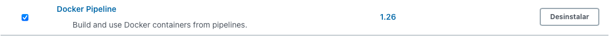

# Ca5 - part 2 - Jenkins

So let's start our second Jenkins tutorial!

This time we're going to start right away, and then the project developed in Ca2/part_2 will be used.

## 1. Initial Setup

### Important warning

In the first attempt at implementation, the container used in Ca5 part 1 was used, but I had difficulty using the docker
engine present on the host (due to permissions issues), so in this part the Jenkins war file was used!

## 1.1. Jenkins war file

To use jenkins from the war file is as simple as downloading it, and from the command line, in the folder where it
was placed, run the following command:

```
$ java -jar jenkins.war
```

Optionally we can specify the port:

```
$ java -jar jenkins.war --httpPort=<port_number>
```

Make sure your machine is running jdk11, my first attempt was using jdk16 and had to change it using skd (Software
Development Kit Manager).

## 1.2. Create a new job and Add Credentials

To Create a new job and Add Credentials follow the steps carried out in Ca5/part_2 (steps 2. and 3.), and can be found 
[here](../part_1/README.md)!

## 2. Jenkins Pipeline

### 2.1 Initial Layout

Let's configure our Pipeline, accessing the configuration and in the pipeline section choose Pipeline script.


The initial layout of the pipeline was as follows:

```
pipeline {
    
    agent any
    
    stages {
        
        stage("Checkout") {
            steps{
                echo 'Checkout'
            }
        }
        
        stage("Assemble") {
            steps{
                echo 'Assemble'
            }
        }
    
        stage("Test") {
            steps{
                echo 'Test'
            }
        }
        
        stage("Javadoc") {
            steps{
                echo 'Javadoc'
            }
        }
        
        stage("Archive") {
            steps{
                echo 'Archive'
            }
        }
        
        stage("Publish Image") {
            steps{
                echo 'Publish Image'
            }
        }
    }
}
```

Afterwards, the following changes were added.

### 2.2. Checkout

We now need the id of the previously created credentials and the url of the remote repository for the server to be able
to checkout.

```
...
        stage("Checkout") {
            steps{
                git credentialsId: 'bitbucket-credentials', url: 'https://bitbucket.org/Joao_Pinto_1201765/devops-20-21-1201765/src/master/'
            }
        }
...
```

### 2.3. Assemble

For the Assemble stage, the gradle assemble command was used to generate the .war file instead of the gradle build to
run the tests on the next stage.

It was also necessary to add the plugin that generates the war file in build.gradle:

```
plugins {
    [...]
    id 'war'
}
```

For this tutorial we used the project located in the folder Ca2/part_2/tut-basic-gradle/, so to run commands outside the
root of the project we have to use the following block:

```
    dir(<intedend-folder>){
        // comands
       
    }
```

A script block was also added, to run different commands, depending on the operating system where the Jenkins server is
running, Unix like or Windows.

```
...
        stage("Assemble") {
            steps{
                echo 'Assemble'
                
                dir('Ca2/part_2/tut-basic-gradle/'){
                    script {
                        if(isUnix() == true) {
                            sh './gradlew clean assemble'
                        } else {
                            bat './gradlew clean assemble'
                        }
                    }
                    
                }
            }
        }
...
```

### 2.4. Test

In stage Test, we will use the gradle test to run the tests and the JUnit step to publish the test results.

```
...
        stage("Test") {
            steps{
                echo 'Test'
                dir('Ca2/part_2/tut-basic-gradle/'){
                    script{
                        if (isUnix() == true) {
                            sh './gradlew test'
                        } else {
                            bat './gradlew test'
                        }
                    }
                    junit 'build/test-results/**/*.xml'
                }
            }
        }
...
```

### 2.5. Javadoc

For the stage of generating the javadocs it was necessary to add the classpath and the source to the javadoc task of the
gradle, adding the following to the build.gradle:

```
javadoc {
    classpath += sourceSets.main.compileClasspath
    source += sourceSets.main.allJava
}
```

To publish the generated html it is necessary to install the plugin HTML Publisher on the page to manage the plugins.


In the pipeline, the Javadoc stage will look like this:

```
...
        stage("Javadoc") {
            steps{
                echo 'Javadoc'
                dir('Ca2/part_2/tut-basic-gradle/'){
                    script{
                        if (isUnix() == true) {
                            sh './gradlew javadoc'
                        } else {
                            bat './gradlew javadoc'
                        }
                    }
                    publishHTML (target: [
                        keepAll: true,
                        reportDir: 'build/docs/javadoc/',
                        reportFiles: 'index.html',
                        reportName: 'Javadoc'
                  ])
                }
            }
        }
...
```

In the project menu a new icon will appear, called Javadoc, which will take us to the generated index.html.


### 2.6. Archive

On the Archive stage, the archiveArtifacts step was used to archive the .war file generated when running the
gradle assemble.

```
...
        stage("Archive") {
            steps{
                echo 'Archive'
                dir('Ca2/part_2/tut-basic-gradle/'){
                    archiveArtifacts artifacts: 'build/libs/**/*.war'    
                }
            }
        }
...
```

### 2.7. Publish Image

To build a docker image from a Jenkins pipeline, we first need to install the Docker Pipeline plugin.



Next, just like we did with the remote repository credentials, we need to add the Docker Hub access credentials.


We also have to create a new repository in the docker hub to push the created images.


To build using a Dockerfile, it is necessary to add a Dockerfile to the Ca2/part_2/tut-basic-gradle folder, with the
following content:

```
FROM tomcat

RUN apt-get update -y

RUN apt-get install -f

RUN apt-get install git -y

RUN apt-get install nodejs -y

RUN apt-get install npm -y

RUN mkdir -p /tmp/build

ADD /build/libs/tut-basic-gradle-0.0.1-SNAPSHOT.war /usr/local/tomcat/webapps/

EXPOSE 8080
```

The Dockerfile will copy the war file generated on the Assemble stage to the /usr/local/tomcat/webapps/ folder inside
the image, thus avoiding the need to rebuild the project when building the image.

Finally, in the pipeline we will add the Publish Image stage, adding the environment (with the necessary data for the
image push) and the part of the stage itself:

```
pipeline {
    environment {
        registry = 'joaopintodev/ca5-part2-jenkins'
        registryCredential = 'docker-hub_credentials'
        dockerImage = ''
    }
    
    [...]
    
    stage("Publish Image") {
            steps{
                echo 'Publish Image'
                dir('Ca2/part_2/tut-basic-gradle/'){
                    script{
                        dockerImage = docker.build registry + ":$BUILD_NUMBER"
                        docker.withRegistry( '', registryCredential ) {
                            dockerImage.push()
                        }
                    }
                    sh "docker rmi $registry:$BUILD_NUMBER"
                }
            }
        }
    }
}
```


### 2.8. Final Pipeline Script

```
pipeline {
    environment {
        registry = 'joaopintodev/ca5-part2-jenkins'
        registryCredential = 'docker-hub_credentials'
        dockerImage = ''
    }
    
    agent any
    
    stages {
        
        stage("Checkout") {
            steps{
                echo 'Checkout'
                git credentialsId: 'bitbucket-credentials', url: 'https://bitbucket.org/Joao_Pinto_1201765/devops-20-21-1201765/src/master/'
            }
        }

        
        stage("Assemble") {
            steps{
                echo 'Assemble'
                dir('Ca2/part_2/tut-basic-gradle/'){
                    script {
                        if(isUnix() == true) {
                            sh './gradlew clean assemble'
                        } else {
                            bat './gradlew clean assemble'
                        }
                    }
                    
                }
            }
        }
    
        stage("Test") {
            steps{
                echo 'Test'
                dir('Ca2/part_2/tut-basic-gradle/'){
                    script{
                        if (isUnix() == true) {
                            sh './gradlew test'
                        } else {
                            bat './gradlew test'
                        }
                    }
                    junit 'build/test-results/**/*.xml'
                }
            }
        }
        
        stage("Javadoc") {
            steps{
                echo 'Javadoc'
                dir('Ca2/part_2/tut-basic-gradle/'){
                    script{
                        if (isUnix() == true) {
                            sh './gradlew javadoc'
                        } else {
                            bat './gradlew javadoc'
                        }
                    }
                    publishHTML (target: [
                        keepAll: true,
                        reportDir: 'build/docs/javadoc/',
                        reportFiles: 'index.html',
                        reportName: 'Javadoc'
                  ])
                }
            }
        }
        
        stage("Archive") {
            steps{
                echo 'Archive'
                dir('Ca2/part_2/tut-basic-gradle/'){
                    archiveArtifacts artifacts: 'build/libs/**/*.war'    
                }
            }
        }
        
        stage("Publish Image") {
            steps{
                echo 'Publish Image'
                dir('Ca2/part_2/tut-basic-gradle/'){
                    script{
                        dockerImage = docker.build registry + ":$BUILD_NUMBER"
                        docker.withRegistry( '', registryCredential ) {
                            dockerImage.push()
                        }
                    }
                    sh "docker rmi $registry:$BUILD_NUMBER"
                }
            }
        }
    }
}
```

Hit save and let's build!

### Important warning

The desktop docker must be turned on, otherwise the build will fail because it cannot access Docker.

### 2.9. After build view


## 3. build from Jenkinsfile

To use a Pipeline script that is in the remote repository, we have to create a file called Jenkinsfile without
extension, and put the Pipeline that was previously developed in it (same as it is in 4.5. section).

As we were using the project Ca2/part_2/tut-basic-gradle the Jenkinsfile was created in that folder.

Now let's create a new job, just like the one created in point 2., but in the definition choose Pipeline script from
SCM, it is necessary to put the url of the remote repository and the access credentials:


In the Script Path we must put the path to access the Jenkinsfile, which in our case is found in
Ca2/part_2/tut-basic-gradle/Jenkinsfile:


Now we can save, and if the Gods are with us, the build will run smooth and flawless.


## 6. References

https://turkogluc.com/build-and-deploy-gradle-projects-with-jenkins/

https://stackoverflow.com/questions/44185165/what-are-the-differences-between-gradle-assemble-and-gradle-build-tasks

https://www.jenkins.io/doc/pipeline/tour/tests-and-artifacts/


https://hub.docker.com/r/jetbrains/teamcity-server/

https://blog.jetbrains.com/teamcity/2019/03/configuration-as-code-part-2-working-with-kotlin-scripts/

https://www.overops.com/blog/jenkins-vs-travis-ci-vs-circle-ci-vs-teamcity-vs-codeship-vs-gitlab-ci-vs-bamboo/

https://medium.com/@sergedevelops/getting-started-with-pipeline-as-code-using-kotlin-and-teamcity-236ecb8ed6e

https://www.jetbrains.com/help/teamcity/jenkins-to-teamcity-migration-guidelines.html#Build

https://www.jetbrains.com/teamcity/

https://dzone.com/articles/building-docker-images-to-docker-hub-using-jenkins

https://lobster1234.github.io/2019/04/05/docker-socket-file-for-ipc/

https://www.jenkins.io/doc/book/installing/war-file/